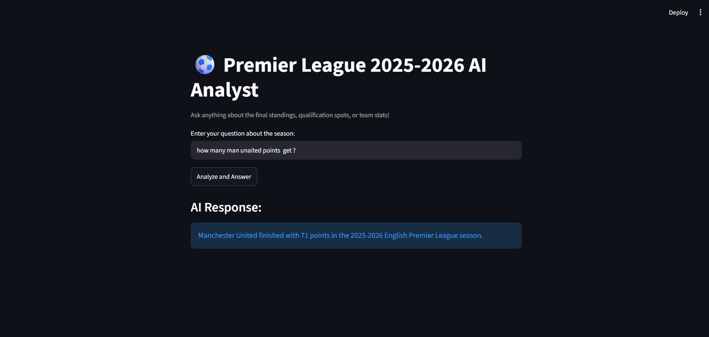

# ⚽ Premier League 2025–2026 AI Analyst

A lightweight AI-powered web application that answers questions about the **2025–2026 English Premier League final standings**.

The application uses **Streamlit** for the user interface and the **Groq API** with an OpenAI-compatible client to generate answers from a provided Premier League dataset.

> This project was originally built as **Project 1 of the LLM Zoomcamp by DataTalksClub** and has since been reorganized and updated as part of my AI Engineering journey.

---

## 🚀 Live Demo

**Streamlit App:**  
[Open the Premier League AI Analyst](https://3ucnt9cnock9gsn7ab3cuw.streamlit.app/)


---

## ✨ Features

* ⚽ Ask natural-language questions about the Premier League standings.
* 🤖 Uses an LLM through the Groq API.
* 🧠 Provides the league table as context to the model.
* 🌐 Interactive web interface built with Streamlit.
* 🔐 API credentials are loaded from environment variables.
* 🐍 Built with Python.
* 📦 Project dependencies are defined in `pyproject.toml`.

---

## 🛠️ Tech Stack

* **Python**
* **Streamlit**
* **Groq API**
* **OpenAI Python SDK**
* **python-dotenv**

---

## 📂 Project Structure

```text
premier-league-ai-analyst/
│
├── assets/
│   └── screenshot.png
│
├── app.py
├── pyproject.toml
└── README.md
```

---

## ⚙️ Setup

### 1. Clone the Repository

```bash
git clone <your-repository-url>
cd AI-Engineer-Journey/projects/premier-league-ai-analyst
```

### 2. Install Dependencies

Make sure Python 3.13+ is installed.

Install the required packages:

```bash
pip install openai python-dotenv streamlit
```

### 3. Configure Environment Variables

Create a `.env` file inside the project directory:

```env
GROQ_API_KEY="your_groq_api_key"
GROQ_API_BASE_URL="https://api.groq.com/openai/v1"
```

**Never commit your `.env` file or API keys to GitHub.**

### 4. Run the Application

```bash
python -m streamlit run app.py
```

The application should open locally at:

```text
http://localhost:8501
```

---

## 🧠 How It Works

The application follows a simple LLM question-answering workflow:

```text
User Question
      ↓
Streamlit Interface
      ↓
Premier League Dataset + User Question
      ↓
Groq API
      ↓
LLM Response
      ↓
Displayed Answer
```

The Premier League standings are included in the prompt as contextual information. The user question is then sent to the model together with this context.

---

## 📸 Screenshot



---

## 📚 Learning Context

This project helped me practice:

* Working with LLM APIs
* Prompt construction
* Environment variables and API credentials
* Streamlit application development
* Python project organization
* Building a simple AI-powered application

---

## 👨‍💻 Author

**Ahmed Abdullatif**

Computer Science Student | Aspiring AI Engineer

GitHub: [AhmedAbdullatifA](https://github.com/AhmedAbdullatifA)

